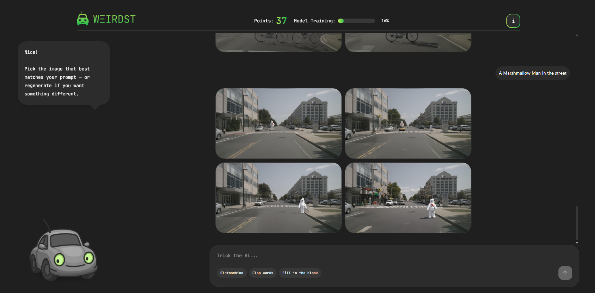
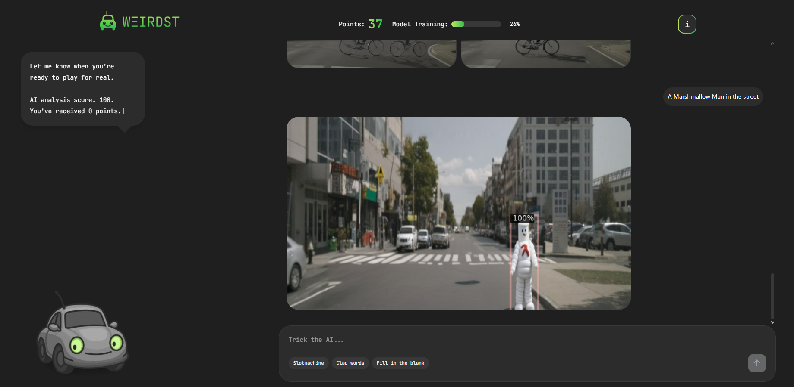

# Weird Stuff In Traffic - Frontend

This project contains the frontend part of a web application developed to visualize and analyze weird incidents in traffic. The project was bootstrapped with [Next.js](https://nextjs.org/) using [`create-next-app`](https://nextjs.org/docs/app/api-reference/cli/create-next-app).

## Getting Started

Follow the steps below to run the project in development mode:

1.  Navigate to the frontend folder from the repository's root directory:
    ```bash
    cd Weird-Stuff-In-Traffic/App/Frontend/weird-traffic-app
    ```
2.  Install the necessary packages (if not already installed):
    ```bash
    npm install
    # or
    yarn install
    # or
    pnpm install
    # or
    bun install
    ```

## Screenshots

Here are a few screenshots of the application in action:

_Landing_


_Generation_


_Detection_


## 📁 Project Structure

-   **`weird-traffic-app/`** - The root directory of the Next.js application.
    -   **`public/`**: Contains static assets like images (`car.png`).
    -   **`src/app/`**: The core of the application, following the Next.js App Router structure.
        -   **`api/`**: Houses the backend API routes.
            -   `detect/route.ts`: Forwards detection requests to the main backend.
            -   `generate/route.ts`: Forwards image generation requests to the main backend.
        -   **`chat/`**: Contains the main client-side chat page and its related logic.
        -   **`components/`**: Home to reusable React components used across the app (e.g., UI elements, game components).
        -   **`constants/`**: Stores static data, like dialog messages and words for the games.
        -   **`hooks/`**: Contains custom React hooks for shared logic.
        -   **`stores/`**: Holds [zustand](https://zustand.docs.pmnd.rs/guides/nextjs) global state management stores.
        -   **`types/`**: Defines TypeScript types and interfaces.
        -   **`utils/`**: Includes utility functions, such as scoring logic.
        -   `globals.css`: Defines global styles and Tailwind CSS configurations.
        -   `layout.tsx`: The root layout component for the entire application.
        -   `page.tsx`: The main page component of the app.
    -   **Configuration Files**: Root files like `next.config.ts`, `tailwind.config.ts`, and `tsconfig.json` configure the project's behavior, styling, and TypeScript settings.

### API Integration and User Interaction Flow

The frontend interacted with backend services via RESTful API endpoints exposed through Next.js API routes. Two primary endpoints were utilized: `/api/generate` for synthetic image generation and `/api/detect` for anomaly detection based on user input.

The `/api/generate` route accepted a user-provided textual prompt and returned an array of Base64 encoded images:

```typescript
// POST /api/generate

// Request body
const requestBody = {
	prompt: 'textual prompt provided by the user',
};

// Type for a single generated image
export interface GeneratedImage {
	prompt: string;
	imageBase64: string;
}

// Response containing multiple generated images
export interface GeneratedImages {
	images: GeneratedImage[];
}
```

After image selection, the `/api/detect` endpoint was called with both the original prompt and the selected image. The response included a similarity score and a processed image, also Base64 encoded:

```typescript
// POST /api/detect

// Request body
const requestBody = {
	prompt: 'Associated textual prompt',
	imageBase64: '...', // selectedImage
};

// Response type
export interface DetectApiResponse {
	prompt: string; // The prompt used for detection
	score: number;
	imageBase64: string; // detectedImage
}
```

## Learn More

To learn more about Next.js, take a look at the following resources:

-   [Next.js Documentation](https://nextjs.org/docs) - learn about Next.js features and API.
-   [Learn Next.js](https://nextjs.org/learn) - an interactive Next.js tutorial.

You can check out [the Next.js GitHub repository](https://github.com/vercel/next.js) - your feedback and contributions are welcome!

## Deploy on Vercel

The easiest way to deploy your Next.js app is to use the [Vercel Platform](https://vercel.com/new?utm_medium=default-template&filter=next.js&utm_source=create-next-app&utm_campaign=create-next-app-readme) from the creators of Next.js.

Check out our [Next.js deployment documentation](https://nextjs.org/docs/app/building-your-application/deploying) for more details.
