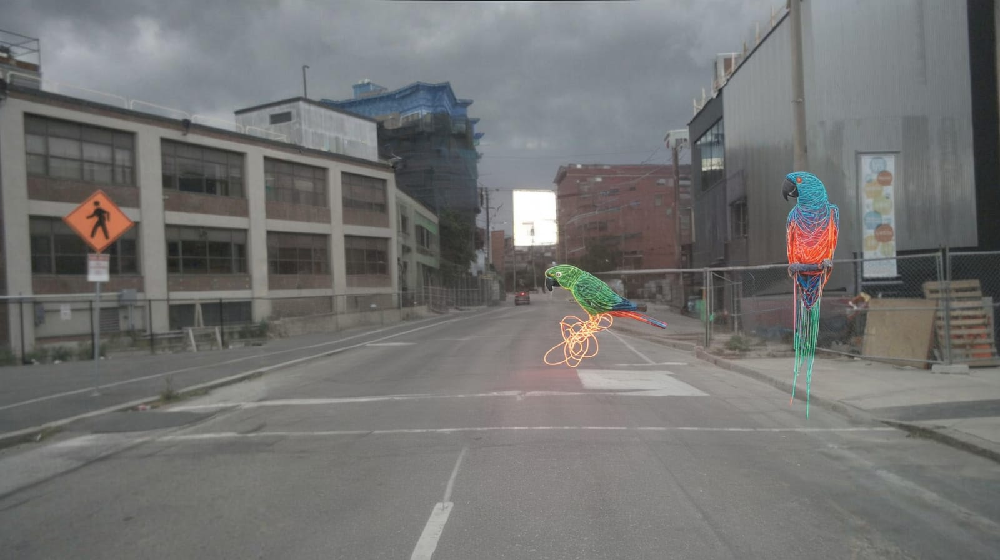

# Weird-Stuff-In-Traffic

### 🚦 Project Summary

Weird Stuff In Traffic is a gamified, web-based app that helps improve object detection models for autonomous driving. Users are prompted to generate bizarre or unexpected traffic scenes using natural language. A fine-tuned AI model then attempts to identify anomalies in these generated images.

The twist? You're trying to break the model — the more unusual the scene, the more likely you'll find its blind spots. This helps surface edge cases where the AI might fail, making it a valuable tool for stress-testing perception systems in self-driving cars.

  
  

<em>Figure 1: Generated Images for an "Exploding Cow" and "Neon stringed parrots".</em>

  

<em>Figure 2: User Interface.</em>

### 🚀 Getting Started
#### 📦 Install Dependencies
1. To install all the necessary Python libraries, run the following in your terminal of choice from the project's home directory: `pip install requirements.txt`
2. To then install all necessary node packages, navigate to `Weird-Stuff-In-Traffic/App/Frontend/weird-traffic-app` and run `npm install`

#### 🧠 Running the App
1. From the home project directory, run the following bash script to simultaneously launch the NextJS Frontend and FastAPI backend: `bash start_app.sh`

### 🖥️ Hardware Requirements
- Nvidia GPU with a minimum of 24GB (Nvidia 4090)

### 👥 Contributors
Thomas Cansfield, Hannah Simson, Ludwig Gallmeier, Ahmed Ibrahim, Albert Didkovski, Andreas Kolbinger, Anja Schlaak, Benjamin Kass, Daniel Shaquille, Hamza Dursun, Kevin Kuhn, \ Martin Lauff, Selin Durmus, Surkhay Khanmammadli, Syed Abidi, Tobias Kerner, Vanessa Rieger

